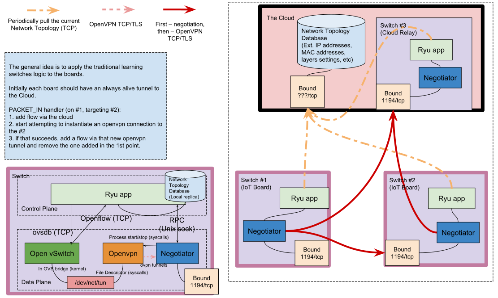
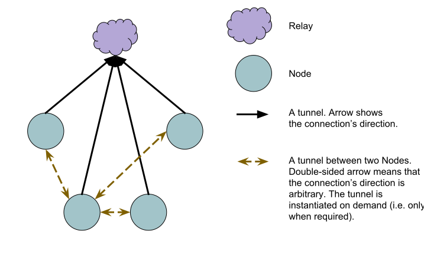
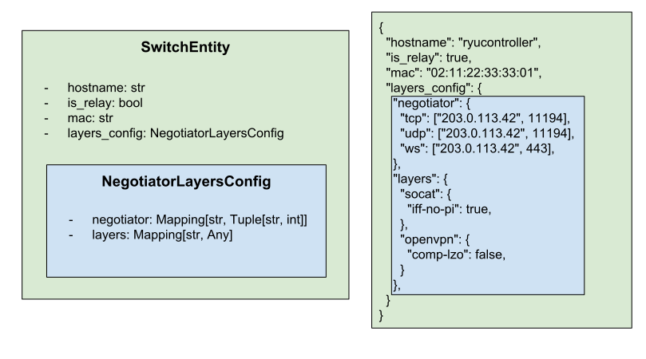

# Agile Mesh Network

## Background

This is a bachelor thesis project. It's not supposed to be maintained,
but the code might be useful for someone:
- There's an example of asyncio and Ryu application logic 
  (i.e. OpenFlow messages) testing.
- There's a solution for running eventlet and asyncio in the same 
  process (in 2 different threads) while maintaining thread-safe 
  communications between the two (See also the [gist][gist_eventlet] 
  showing how eventlet's Queue might be modified from asyncio).
- Negotiator consists of a bunch of asyncio Protocols, which pipe 
  to each other (while correctly addressing the initialization phase, 
  when one end might start writing to the other, which is not yet 
  connected).

Test coverage is ~80%.

[gist_eventlet]: https://gist.github.com/KostyaEsmukov/55f802a638bbe64c0838f43f7c8c02c4

The thesis topic was:
> Applying SDN approaches and techniques to the instantiation of
> virtual private networks for the confidentiality of M2M communications.

The project consists of two modules: `Ryu app` and `Negotiator`. Both
are supposed to be run together on each IoT Board (also called
a `Switch` in SDN manner).

System architecture:

Each Switch initially downloads the Network Topology Database contents,
and then creates a Tunnel (openvpn or socat tcp-tap tunnel) to a single
Relay Switch. All broadcast traffic goes through Relay. Unicast traffic
goes through Relay initially, but after the first packet the Switches
attempt to instantiate a direct Tunnel. If they succeed, the Ryu app
adds OpenFlow flows via that tunnel, which makes the Unicast traffic
go through direct tunnel (instead of Relay).

Network topology (Mesh):

OpenFlow PACKET_IN handler flowchart:

Network Topology Database entity:

## Running tests

    pipenv install -d
    pipenv run testcov

## Packaging

    ./setup.py sdist bdist_wheel

    # Transfer dist/*

    . /opt/amn/venv/bin/activate
    pip install --upgrade <...>.tar.gz

## Setup Network Topology Database

Should be run on a single machine, where the centralized MongoDB instance should run.

    # TODO mongo auth https://docs.mongodb.com/manual/administration/security-checklist/

    apt install mongodb-server

    mongo

    use topology_database
    db.switch_collection.find()

    # Add relays and switches...
    db.switch_collection.save({
      "hostname": "ryucontroller",
      "is_relay": true,
      "mac": "02:11:22:33:33:01",
      "layers_config": {
        "negotiator": {
          "tcp": ["192.168.56.10", NumberInt(11194)],
        },
        "layers": {
          "socat": {}
        }
      }
    })

    # To update a record later:

    db.switch_collection.updateOne(
       { "hostname": "ryucontroller" },
       {
         $set: { "layers_config.negotiator": {"tcp": ["192.168.56.10", NumberInt(11194)] } },
         $currentDate: { lastModified: true }
       }
    )

    db.switch_collection.updateOne(
       { "hostname": "ryucontroller" },
       {
         $set: { "layers_config.layers": { "openvpn" : {  } } },
         $currentDate: { lastModified: true }
       }
    )

## Openvpn certificates

Should be done once on a single machine (e.g. a controller).

    apt install easy-rsa
    cp -aR /usr/share/easy-rsa/ /root/openvpn-easy-rsa
    cd /root/openvpn-easy-rsa
    cp openssl-1.0.0.cnf openssl.cnf
    . ./vars
    ./clean-all
    ./build-ca --batch
    ./build-dh
    ./build-key-server --batch server
    ./build-key --batch client

    tar czf ../openvpn-easy-rsa.tar.gz keys/{ca.crt,dh2048.pem,client.crt,client.key,server.crt,server.key}
    # Transfer this archive to all switches.

## Installation on Debian 9

This package requires Python 3.6.

### Python 3.6

    sudo apt install virtualenv

For raspberry (miniconda for ARM ships Python 3.4):

    apt install libffi-dev
    apt install -t testing python3.6 python3-setuptools python3-dev

    virtualenv /opt/amn/venv --python `which python3`

For amd64:

    wget https://repo.continuum.io/miniconda/Miniconda3-latest-Linux-x86_64.sh
    bash Miniconda3-latest-Linux-x86_64.sh -b -p /opt/miniconda

    virtualenv /opt/amn/venv --python /opt/miniconda/bin/python3

Both:

    . /opt/amn/venv/bin/activate

### OVS

Openvswitch 2.6, currently shipped in Debian stable, has a [bug][ovs_bug]
which doesn't allow to use configurations in /etc/network/interfaces without
tinkering with systemd units. This is fixed in Debian testing, so we need to
install it from there.

[ovs_bug]: https://bugs.debian.org/cgi-bin/bugreport.cgi?bug=878757

    echo "" >> /etc/apt/sources.list
    echo "deb http://httpredir.debian.org/debian testing main" >> /etc/apt/sources.list
    echo 'APT::Default-Release "stable";' | tee -a /etc/apt/apt.conf.d/00local
    apt update
    apt install -t testing openvswitch-switch

### OVS bridges

[Docs](https://github.com/openvswitch/ovs/blob/master/debian/openvswitch-switch.README.Debian).

    MAC_ADDRESS="02:11:22:33:33:01"
    IP_ADDRESS="192.168.128.1"

    cat << EOF >> /etc/network/interfaces

    auto bramn
    allow-ovs bramn
    iface bramn inet static
        ovs_type OVSBridge
        ovs_extra set bridge bramn other-config:hwaddr="${MAC_ADDRESS}" -- set bridge bramn other-config:disable-in-band=true
        address ${IP_ADDRESS}
        netmask 255.255.255.0
    EOF

    ifup --allow=ovs bramn

### Openvpn

    apt install openvpn
    systemctl disable openvpn.service

    mkdir -p /etc/openvpn
    cd /etc/openvpn
    tar xaf openvpn-easy-rsa.tar.gz

    cat << 'EOF' > /etc/openvpn/ifup.up
    #!/bin/sh
    /sbin/ip link set "$1" up
    EOF
    chmod +x /etc/openvpn/ifup.up

    cat << EOF > /etc/openvpn/server.conf
    key keys/server.key
    ca keys/ca.crt
    cert keys/server.crt
    dh keys/dh2048.pem
    user nobody
    group nogroup
    comp-lzo no
    script-security 2
    up "/etc/openvpn/ifup.up"
    EOF

    cat << EOF > /etc/openvpn/client.conf
    client
    nobind
    remote-cert-tls server
    key keys/client.key
    ca keys/ca.crt
    cert keys/client.crt
    dh keys/dh2048.pem
    user nobody
    group nogroup
    comp-lzo no
    script-security 2
    up "/etc/openvpn/ifup.up"
    EOF

### Socat

    apt remove socat
    cd /root
    wget https://github.com/KostyaEsmukov/socat/archive/feature/slip.tar.gz
    tar xaf slip.tar.gz
    cd socat*/
    apt install autoconf libssl-dev yodl
    autoconf
    ./configure
    make
    make install

### Negotiator systemd service

Should be run on each Switch (+ Relays).

    cat << EOF > /etc/systemd/system/amn_negotiator.service
    [Unit]
    Description=Agile Mesh Network negotiator

    [Service]
    Type=simple
    ExecStart=/bin/bash -lc ". /opt/amn/venv/bin/activate && exec negotiator"

    [Install]
    WantedBy=multi-user.target
    EOF

    systemctl daemon-reload
    systemctl start amn_negotiator.service
    systemctl enable amn_negotiator.service

## Switch usage

    ovs-vsctl set-manager ptcp:6640

    # DATAPATH_ID is the local OVS bridge's MAC address
    cat << EOF > /opt/amn/ryu-env
    AMN_REMOTE_DATABASE_MONGO_URI=mongodb://192.168.56.10:27017/
    AMN_OVS_DATAPATH_ID="021122333302"
    AMN_IS_RELAY=False
    EOF

    export $(cat /opt/amn/ryu-env | xargs) && \
    ryu-manager \
    --log-config-file /opt/amn/venv/lib/python3.6/site-packages/agile_mesh_network/ryu_logging.ini \
    /opt/amn/venv/lib/python3.6/site-packages/agile_mesh_network/ryu_app.py

## Performance evaluation with flent

Installation:

    echo "" >> /etc/apt/sources.list
    echo "deb http://httpredir.debian.org/debian/ stretch non-free" >> /etc/apt/sources.list
    apt update
    apt install -y --no-install-recommends python3 python3-pip netperf
    pip3 install flent
    flent --version
    # v1.2.2

Measurements:

    # Initiator:
    flent rrul_be --test-parameter cpu_stats_hosts=localhost --socket-stats -l 60 -H 192.168.128.3 -t t1

